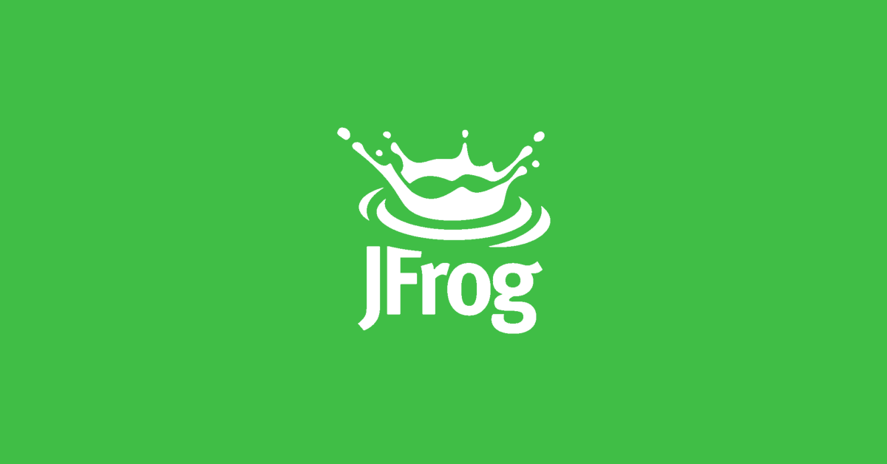

What Sets JFrog Apart and Why It’s an Industry Standard
1. Universal Package Management
JFrog Artifactory is the only package manager that supports all major build artifacts (Docker, Maven, npm, PyPI, Go, Helm, and more). This makes it a one-stop solution for DevOps teams that manage multiple technologies.

2. End-to-End DevOps Automation
JFrog provides a fully automated software release cycle that integrates with CI/CD tools like Jenkins, GitHub Actions, and GitLab CI. It supports binary management, artifact promotion, and dependency caching, streamlining software delivery.

3. Enterprise-Grade Security (Xray)
JFrog Xray offers deep security scanning and license compliance checks, detecting vulnerabilities in open-source dependencies and containers before deployment. It integrates seamlessly with Artifactory.

4. Hybrid & Multi-Cloud Capabilities
Unlike competitors that focus on single-cloud solutions, JFrog provides on-prem, cloud, and hybrid deployment options, ensuring flexibility and compliance.

5. Immutable and Reliable Storage
JFrog stores artifacts immutably across all stages, ensuring version consistency, traceability, and rollback capabilities.

6. Native Integration with Kubernetes & Helm
JFrog simplifies Kubernetes cluster management by integrating with Helm charts, container registries, and K8s package management, making deployments more efficient.

7. DevSecOps-Ready
With automated security policies, access controls, and vulnerability scanning, JFrog is designed for secure, enterprise-grade software supply chains.

Why It’s an Industry Standard
Trusted by Fortune 500 companies like Google, AWS, and Microsoft
Provides fast, secure, and scalable binary distribution
Fully compliant with DevOps and Software Supply Chain Security (SSCS) standards
First to introduce liquid software principles—continuous software delivery without version constraints


# JFrog CLI and Jenkins Pipeline Documentation

## Prerequisites
- Ensure you have a running Docker container with Jenkins available at `http://localhost:8080/`
- A JFrog account and Artifactory instance

---

## Step 1: Setting Up JFrog Repositories
1. Sign into JFrog.
2. Navigate to **Administration** → **Repositories** → **Local** → **Create a Repository** → **Local**.
3. Search for "Generic" in the **New Local Repository** field.
4. Enter the repository key name: `jfrog_cli-01` (Save this for later steps).
5. Click **Create Local Repository**.
6. Add a user in **User Management**:
   - Click **User Management** → **Add New User**.
   - Enter a **User Name** and **Email Address**.
   - Assign **Administer Platform** role.
   - Set a **Password** (Save this for later steps).
   - Click **Save**.

---

## Step 2: Configuring Jenkins Credentials
7. Open Jenkins at `http://localhost:8080/`.
8. Navigate to **Manage Jenkins** → **Security Credentials**.
9. Go to **Stores scoped to Jenkins** → **Global** → **Add credentials**.
10. Enter the following credentials:
    - **Username**: (Same as Step 6)
    - **Password**: (Same as Step 6)
    - **Repository Key**: `jfrog_cli-01` (Same as Step 4)
11. Click **Create** when complete.

---

## Step 3: Configuring JFrog in Jenkins
12. Go to **Manage Jenkins** → **System**.
13. Scroll to **Jfrog Platform Instances**.
14. Enter the **Server Id Name**.
15. Copy and paste the **JFrog Platform URL** from Step 1.
16. Click **Credentials** and select the credentials created in Step 10.
17. Click **Apply/Save**.
18. Scroll to **JFrog CLI installations**.
19. Click **Add JFrog CLI**.
20. Enter the tool name: `jfrog-cli-01`.
21. Check **Install Automatically** (Leave default settings).
22. Click **Apply/Save**.

---

## Step 4: Creating a Jenkins Pipeline for JFrog CLI
23. Open Jenkins and create a new **Pipeline Job**.
24. Modify the pipeline script with the following code:

Example:
```groovy
pipeline {
    agent any
    tools {
        jfrog 'jfrog-cli-latest' // Ensure this matches the tool configuration in Jenkins
    }
    stages {
        stage('Testing') {
            steps {
                jf '-v' // Check JFrog CLI version
                jf 'c show' // Show JFrog CLI config
                jf 'rt ping' // Test connection to Artifactory
                sh 'touch test-file' // Create a test file
                jf 'rt u test-file my-repo/' // Upload test file to your specific Artifactory repository
                jf 'rt bp' // Trigger build promotion in Artifactory
                jf 'rt dl my-repo/test-file' // Download the test file to verify upload
            }
        }
    }
}

```

---

## Step 5: Running the Pipeline

1. Open a terminal and navigate to your project directory.
2. Run `git pull` to sync the latest changes from your GitHub repository (if you’ve updated the Jenkinsfile there).
3. If the Jenkinsfile is stored in GitHub, push any new changes to the repository, which will automatically trigger a Jenkins pipeline build.
4. Go to the Jenkins **Dashboard** → Select your pipeline job → Click **Build Now** to manually start the pipeline if needed.


---

## Additional Resources
- [JFrog Documentation](https://jfrog.com/help/r/artifactory-how-to-use-jfrog-cli-in-jenkins-using-jfrog-plugin/review-a-sample-cli-project)

- [Jfrog comand cheat sheet](https://media.jfrog.com/wp-content/uploads/2021/03/04103525/JFrogCLI_CheatSheet-v2.pdf)


### Demo: To see this code integrated in an exisiting repo click here: [Jfrog-test-file](https://github.com/jaycloud336/Jenkins_AWS_TF_Pipeline/blob/main/Jenkinsfile)